# Gmail connector — the visual walkthrough

This is the **screenshot version** of [setup-google-cloud.md](setup-google-cloud.md),
for people setting this up from **Claude Desktop or Claude Cowork** who don't live
in terminals or cloud consoles. Same 15 minutes, but you can check every screen
against a picture before you click.

If you prefer the compact text version, or you get stuck and want the
troubleshooting table, the [text guide](setup-google-cloud.md) is the canonical
reference. This page never contradicts it — it only adds eyes.

## The map

You are going to do three things, in this order:

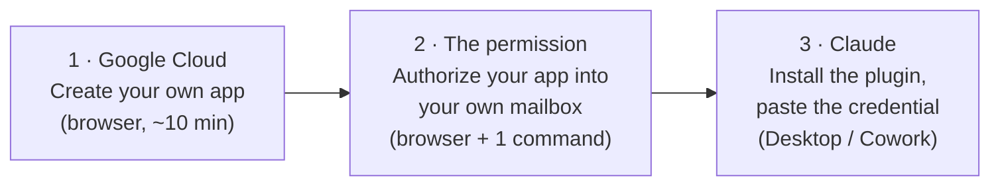

The one idea that makes everything below make sense: **you are not connecting
Claude to Google — you are creating your own tiny Google app**, one that only
you can use, **and lending Claude its key.** Nobody else — not PappCorn, not
Anthropic — is in that loop. That's also why Google may show you a warning
screen near the end: your app is yours, so Google has never heard of it.
That warning is expected, and this guide shows you exactly what it looks like.

> The screenshots below were taken in July 2026 on the current console
> ("Google Auth Platform"). Google moves furniture a couple of times a year;
> if a screen drifts, the [text guide](setup-google-cloud.md) describes each
> step by intent rather than pixel position.

---

## Phase 1 — Google Cloud (the app)

> Everything in this phase happens at
> [console.cloud.google.com](https://console.cloud.google.com), logged in with
> the Google account whose mailbox Claude will use.

### 1.1 Create a project

Click the **project dropdown** in the top bar:

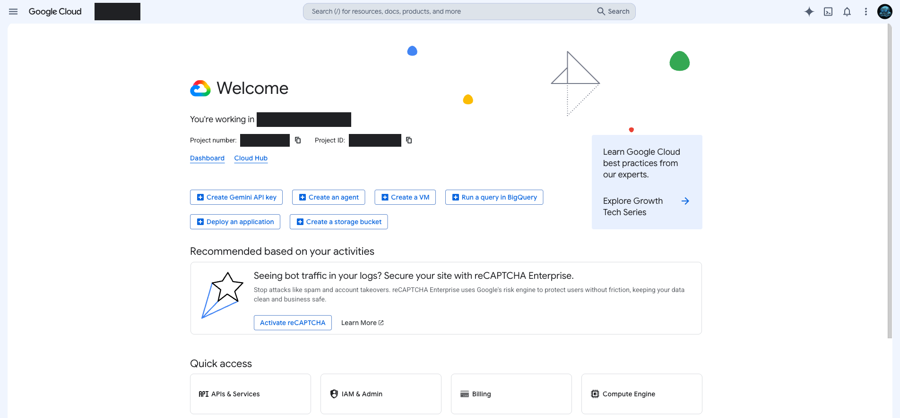

In the dialog that opens, click **New project**:

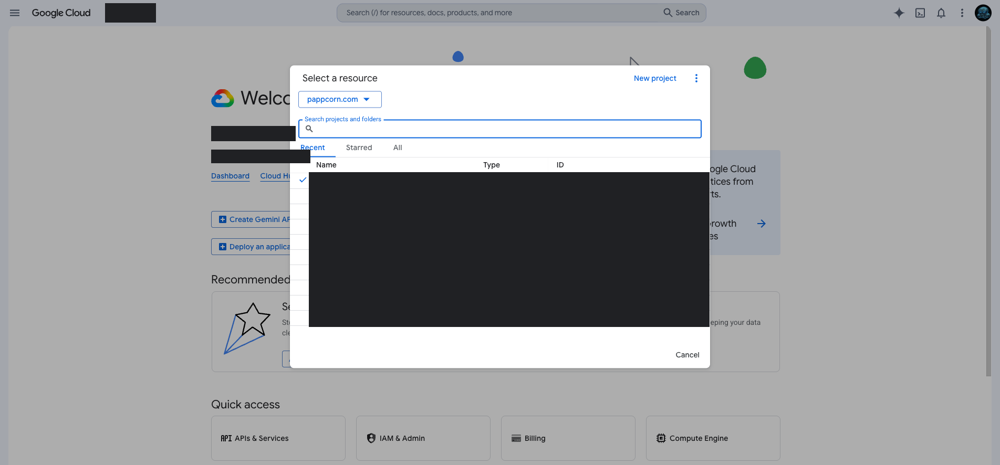

Name it something you'll recognize later (we use `my-assistant` throughout this
guide) → **Create**:

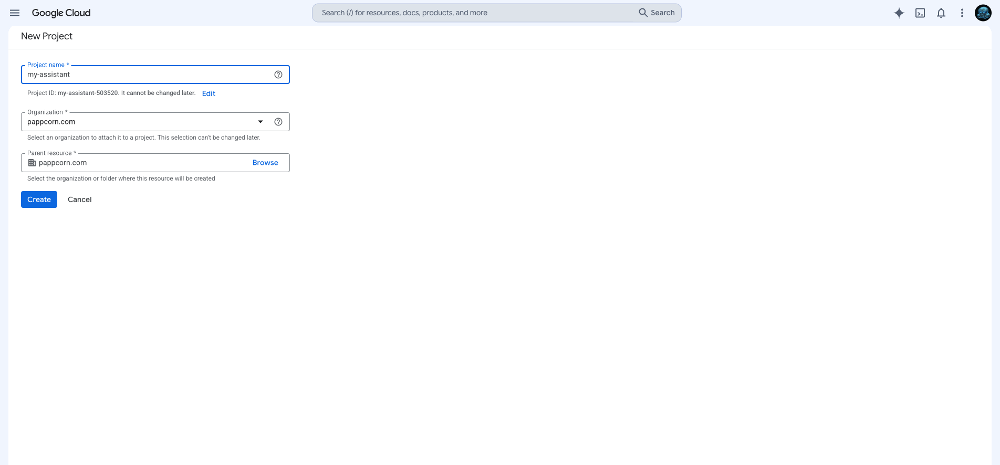

When it finishes, a notification appears — click **Select project** (or make
sure the top-bar dropdown now shows your new project). **Every following step
silently applies to whatever project is selected there.**

> Free. No billing account, no credit card. The Gmail API costs nothing at
> personal volume. If your account is a company Google Workspace account you
> may see an "Organization" field — the default is fine.

### 1.2 Enable the Gmail API

Type **Gmail API** in the top search bar and open the first result:

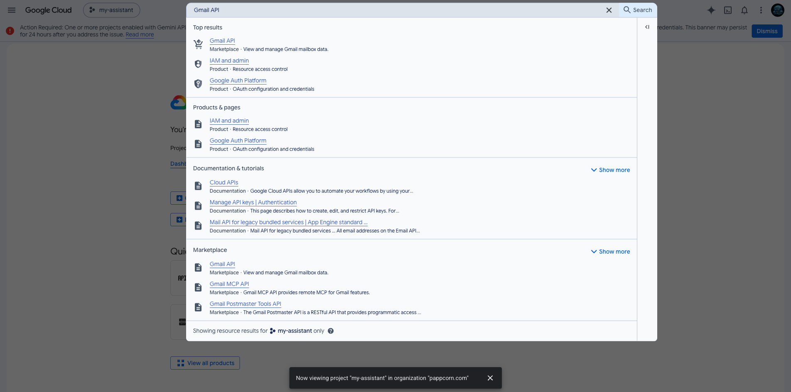

Click **Enable**:

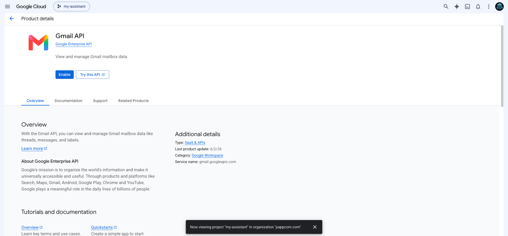

Skipping this is the classic silent failure: everything else will appear to
work and then die at the last step with an unrelated-looking error.

### 1.3 Configure the app (Google Auth Platform wizard)

Search for **Google Auth Platform** (older consoles: **OAuth consent screen**)
and open its **Overview**. First time in, it greets you with:

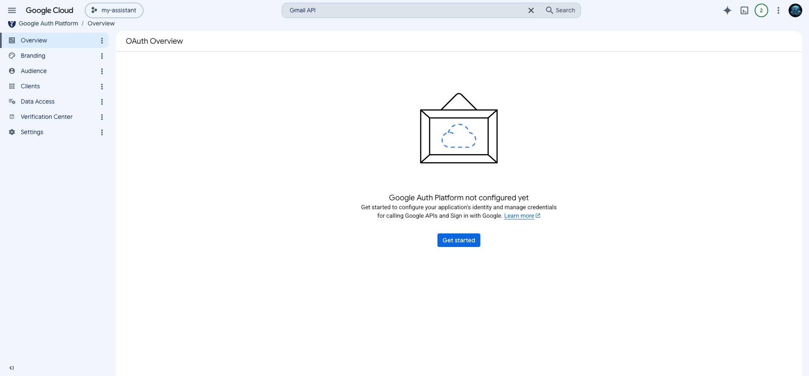

Click **Get started**. A four-step wizard follows.

**Step 1 · App Information** — app name + your email as support contact.
Nothing here is published anywhere:

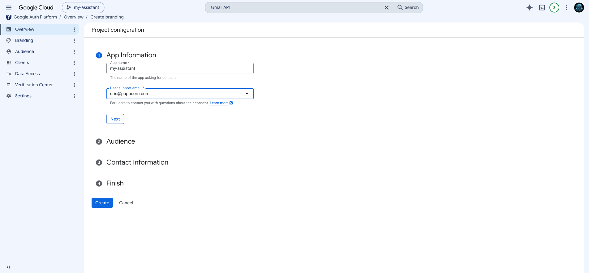

**Step 2 · Audience** — pick **External**. On a personal `@gmail.com` account
it's the only choice, and it does **not** mean public — your app stays yours:

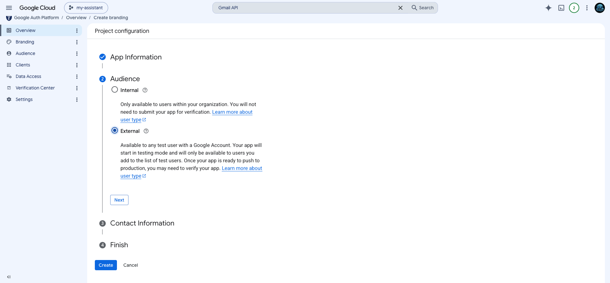

**Step 3 · Contact Information** — your email again.

**Step 4 · Finish** — agree to the user-data policy → **Create**. You land on
the configured overview:

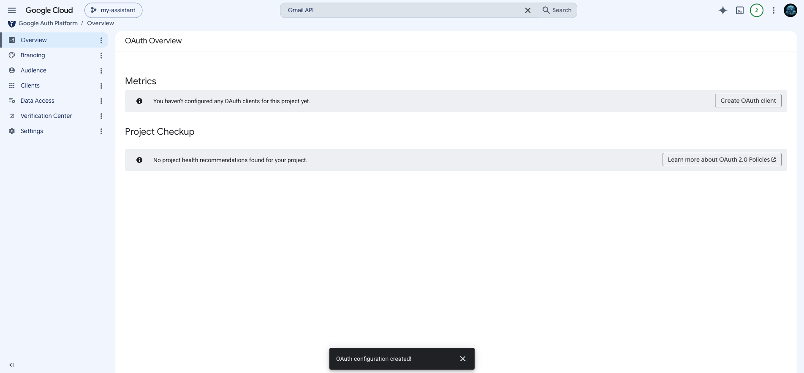

### 1.4 Scopes (Data Access)

Left sidebar → **Data Access** → **Add or remove scopes**. Fastest path: paste
both scopes into the **"Manually add scopes"** box at the bottom of the panel,
comma-separated, then **Add to table** → **Update**:

```
https://www.googleapis.com/auth/gmail.modify, https://www.googleapis.com/auth/gmail.send
```

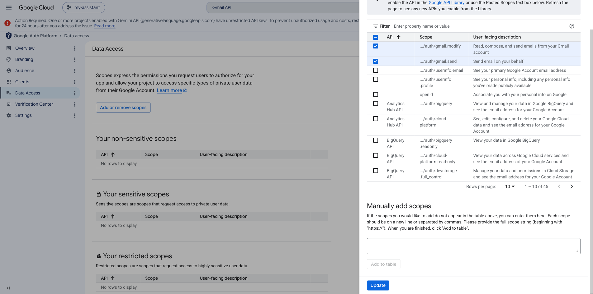

| Scope                   | What it allows               |
| ----------------------- | ---------------------------- |
| `.../auth/gmail.modify` | read, search, label, archive |
| `.../auth/gmail.send`   | send                         |

Back on the Data Access page, `gmail.send` shows under **sensitive** scopes and
`gmail.modify` under **restricted** — that's Google's classification, not a
problem for a single-user app. **Click Save**:

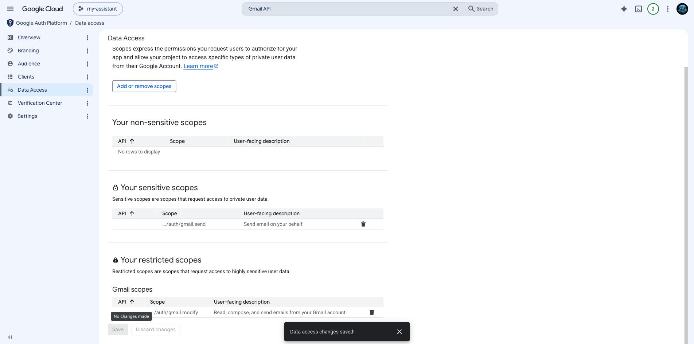

### 1.5 ⚠️ Publish to Production — do not skip

Left sidebar → **Audience**. Publishing status says **Testing**:

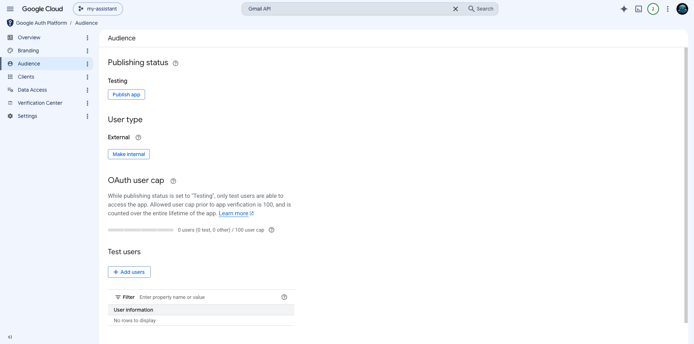

**This is the step everyone gets wrong.** An app left in _Testing_ mints
tokens that **expire after 7 days**: it all works today and silently dies next
week. Click **Publish app** → **Confirm**:

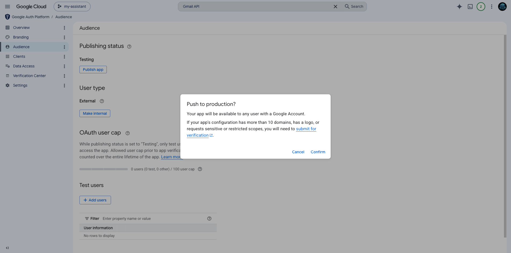

It must now read **In production**:

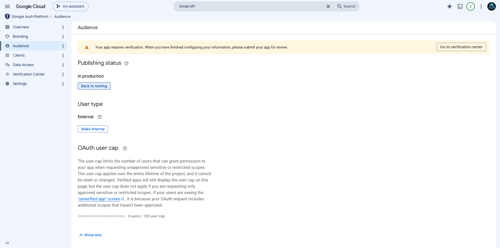

Publishing does **not** require Google's review — an unverified production app
is fine for its one user: you.

### 1.6 Create the OAuth client (the key material)

Left sidebar → **Clients** → **Create client**. Application type:
**Desktop app** (this matters — Desktop clients can use a local loopback
redirect, so you don't have to host anything). Name it and **Create**:

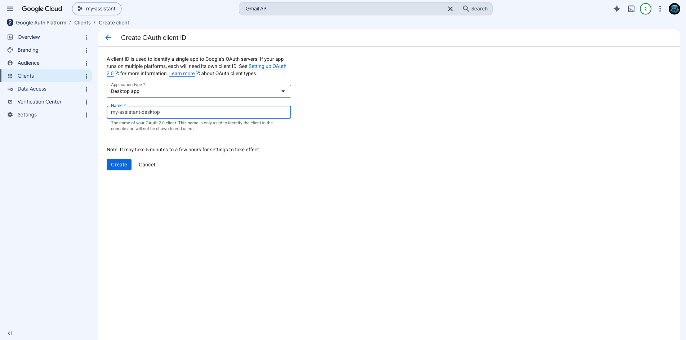

A dialog confirms creation and shows your **Client ID**:

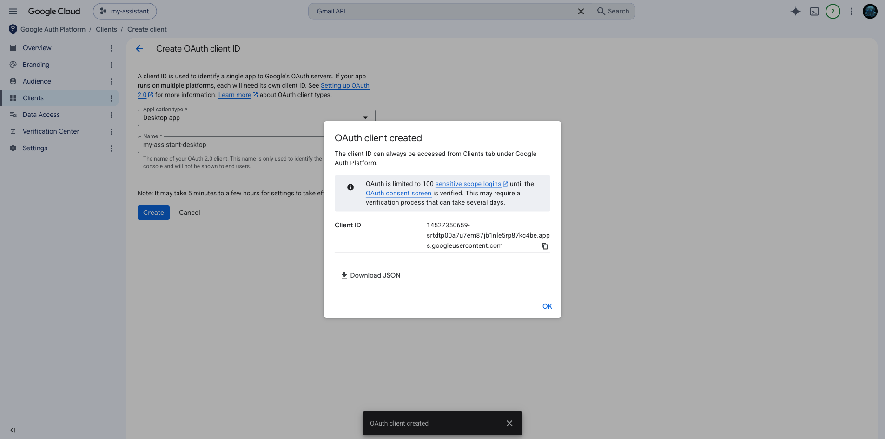

Click the **download** icon in that dialog (or later, the ⬇ next to the client
in the Clients list) to download the **client JSON** and remember where it
landed (usually `~/Downloads`).

> That JSON identifies _your app_. It is not yet a key to your mailbox — that's
> what Phase 2 mints. Still, treat it like a secret and delete it once Phase 2
> is done.

---

## Phase 2 — The permission (the part everyone asks about)

Your app exists; now you authorize it into your own mailbox, once. One command
in any terminal — nothing to clone, it runs straight off the published npm
package:

```bash
npx -y -p @pappcorn/gmail-mcp pappcorn-gmail-setup --client ~/Downloads/client_secret_xxx.json --account you@example.com
```

> **On Claude Cowork / Desktop?** You don't have to run this yourself — ask
> Claude: _"run the gmail-mcp setup command with the client JSON in my
> Downloads folder"_. The only requirement is Node 20+; Claude can check that
> and hand you the browser part below.

The script prints a URL and waits. Open the URL. Now the screens, in order:

### 2.1 Pick the account

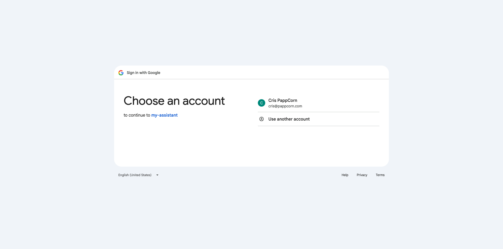

Choose the mailbox you want Claude to use — the same one you passed to
`--account`. If they don't match, the script refuses to save. That's a feature.

### 2.2 The warning screen — expected, and actually good news

**"Google hasn't verified this app."** This is the screen that stops most
people:

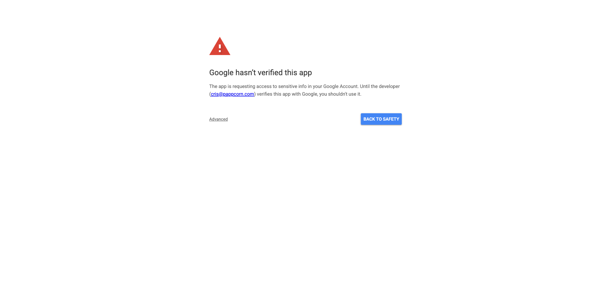

Read it knowing what it actually says: _this app has not been reviewed by
Google_. Of course it hasn't — **you created it fifteen minutes ago and
you're its only user.** Google's review exists to protect other people from
your app; there are no other people. (The developer email it shows is your
own — you typed it in step 1.3.)

Click **Advanced**, then **Go to \<your app name\> (unsafe)**:

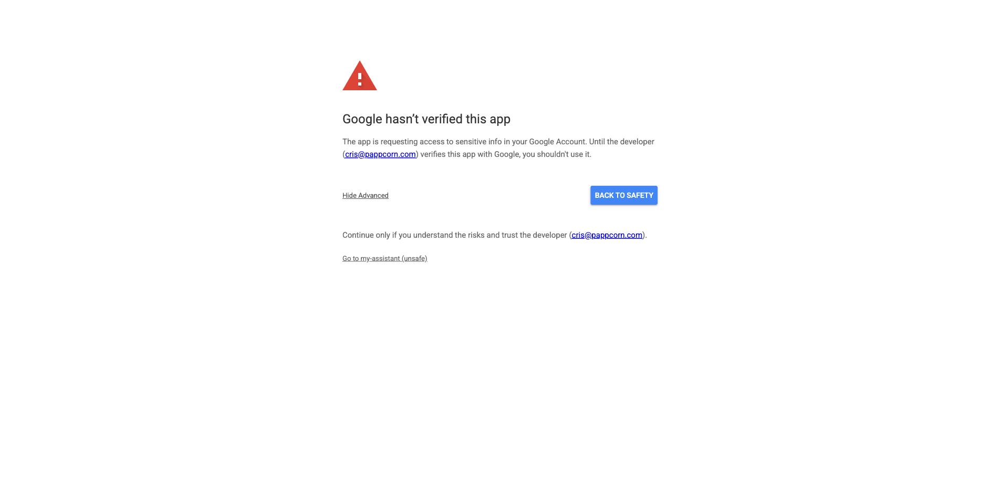

The "(unsafe)" label is Google talking to the general public about unknown
apps — not about yours.

> Not seeing this screen? Two legitimate reasons: your Google account belongs
> to the **same Workspace organization** that owns the Cloud project (Google
> trusts in-house apps), or you already authorized this app once. Either way:
> straight to 2.3.

### 2.3 Grant the two permissions

Google lists exactly what your app may do — the two scopes from step 1.4 and
nothing else:

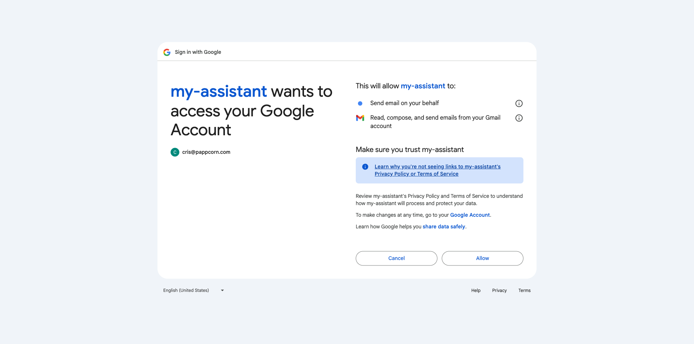

Click **Allow**.

The browser lands on a local address, the script catches it, prints which
mailbox authorized, and writes the credential to
`~/.config/pappcorn-gmail-mcp/credentials.json` (permissions `600`, readable
only by you). **The refresh token is never shown on screen.**

### 2.4 Verify

```bash
npx -y -p @pappcorn/gmail-mcp pappcorn-gmail whoami
```

Your own address plus message/thread counts = done. Now delete the client JSON
from Downloads — everything it contained lives in the credential file.

---

## Phase 3 — Install into Claude

### Claude Desktop / Cowork (plugin — recommended)

```
/plugin marketplace add pappcorn/universe
/plugin install gmail-mcp@pappcorn
```

You'll be prompted for the three credential values (client ID, client secret,
refresh token). They're stored in your **operating system's keychain** — not in
any file — and handed to the connector as environment variables.

> Where do I get those three values? They're inside
> `~/.config/pappcorn-gmail-mcp/credentials.json` from Phase 2. Ask Claude to
> read them into the prompt for you — or, if you keep the file, you can skip
> the prompt entirely by leaving the fields empty: with no explicit values, the
> connector reads that file on its own.

### Claude Code (from source or npm)

See [install.md](install.md) — same credential, different registration.

### First conversation

Ask something harmless: _"what's in my inbox from this week?"_ — the Gmail
tools should appear. Claude will always confirm recipient, subject and body
with you before anything is sent, and the connector cannot delete mail at all.

---

## If a screen doesn't match

Google moves its console around a couple of times a year. If a screenshot here
looks stale, the [text guide](setup-google-cloud.md) describes each step by
intent rather than pixel position — and its
[troubleshooting table](setup-google-cloud.md#when-something-breaks) covers
every known failure, including the famous _worked-for-a-week-then-stopped_
(that's step 1.5).
